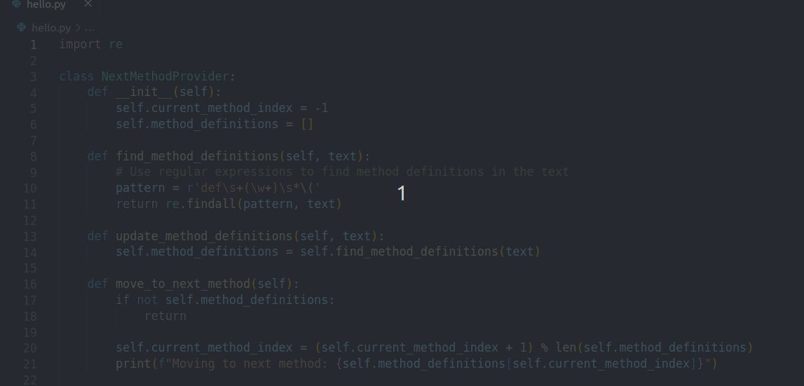

# next_method() VSCode Extension

Quickly navigate from one method to the next one by using `next_method()` extension for Visual Studio Code.

It currently supports two commands
- [`Alt Down`] `next-method.moveCursorToNextDefinition`: Move cursor to next method, class or main guard definition.
- [`Alt + Up`] `next-method.moveCursorToPreviousDefinition`: Move cursor to previous method, class or main guard definition.

> NOTE: This extension works only for Python at the moment.

> Note: The default Keybinding `Alt + Up` and `Alt + Down` may replace your existing keybindings.

**Enjoy!**
